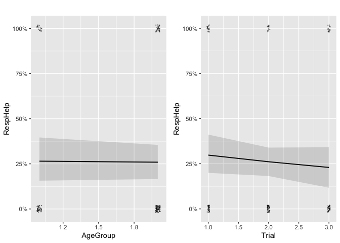

Homework 9: Preliminary Analysis
================
Eloise Pedersen and Alex Raport
2022-11-08

-   <a href="#description-of-each-variable-in-your-preliminary-analysis"
    id="toc-description-of-each-variable-in-your-preliminary-analysis">Description
    of each variable in your preliminary analysis</a>
-   <a href="#model-equations" id="toc-model-equations">Model equations</a>
-   <a href="#your-code-for-running-the-multilevel-analyses"
    id="toc-your-code-for-running-the-multilevel-analyses">Your code for
    running the multilevel analyses</a>
    -   <a href="#unconditional-model"
        id="toc-unconditional-model">Unconditional Model</a>
    -   <a href="#icc" id="toc-icc">ICC</a>
    -   <a href="#human-model-for-effect-of-age-on-helper-chosen"
        id="toc-human-model-for-effect-of-age-on-helper-chosen">Human model for
        effect of Age on Helper chosen</a>
    -   <a href="#chimp-model-for-effect-of-age-on-helper-chosen"
        id="toc-chimp-model-for-effect-of-age-on-helper-chosen">Chimp model for
        effect of Age on Helper chosen</a>
    -   <a
        href="#combined-model-for-effect-of-age-group-and-species-on-helper-chosen"
        id="toc-combined-model-for-effect-of-age-group-and-species-on-helper-chosen">Combined
        model for effect of Age Group and Species on Helper chosen</a>
-   <a href="#a-table-summarizing-model-results"
    id="toc-a-table-summarizing-model-results">A table summarizing model
    results</a>
-   <a
    href="#a-short-paragraph-summarizing-the-findings-from-your-model-addressing-your-research-questions"
    id="toc-a-short-paragraph-summarizing-the-findings-from-your-model-addressing-your-research-questions">A
    short paragraph summarizing the findings from your model addressing your
    research questions.</a>
    -   <a href="#calculations" id="toc-calculations">Calculations</a>
    -   <a href="#interpretations" id="toc-interpretations">Interpretations</a>

# Description of each variable in your preliminary analysis

Level 1: Response (repeated measure) Level 2: Individuals

Level 1 predictors: none Level 2 predictors: Age; species type (human or
chimpanzee)

Outcome: Individual helper/model selected (Bernoulli distribution marked
as 0 or 1)

See the below graph for a visualization of the Bernoulli distribution:

<!-- -->

# Model equations

$$
  \begin{aligned}
    Y_{ti} & = \beta_{0j} + \beta_{1i} \text{Trial}_{ti} + \beta_{2i} \text{Species}_{ti} + e_{ti} \\
    \beta_{0i} & = \gamma_{00} + {\color{red}{\gamma_{01}}} W_i + u_{0i} \\
    \beta_{1i} & = \gamma_{10} + \gamma_{11} W_i + u_{1i} \\
    \beta_{2i} & = \gamma_{20} + \gamma_{21} W_i + u_{2i} \\
    Y_{ti} & = \gamma_{00} + {\color{red}{\gamma_{01}}} W_i + u_{0i} + 
    \gamma_{10}\text{Trial}_{ti} + \gamma_{11} W_i * \text{Trial}_{ti} + u_{1i} * \text{Trial}_{ti} + 
    \gamma_{20}\text{Species}_{ti} + \gamma_{21} W_i * \text{Species}_{ti} + u_{2i} * \text{Trial}_{ti} 
    + e_{ti}
  \end{aligned}
$$

Where $W$ is Age Group

# Your code for running the multilevel analyses

## Unconditional Model

``` r
#Human
set.seed(1000)
unconhum <- brm(RespHelp ~ (1 | ID),
                  data = data1,
                  family = bernoulli("logit"), file = "huicc")


#Chimp
unconchi <- brm(RespHelp ~ (1 | ID),
                  data = data2,
                  family = bernoulli("logit"), file = "chicc")

#Both
unconbo <- brm(RespHelp ~ (1 | ID),
                  data = data3,
                  family = bernoulli("logit"), file = "boicc")
```

## ICC

``` r
set.seed(1000)
performance::icc(unconhum)
```

    ## # Intraclass Correlation Coefficient
    ## 
    ##     Adjusted ICC: 0.075
    ##   Unadjusted ICC: 0.075

``` r
performance::icc(unconchi)
```

    ## # Intraclass Correlation Coefficient
    ## 
    ##     Adjusted ICC: 0.068
    ##   Unadjusted ICC: 0.068

``` r
performance::icc(unconbo)
```

    ## # Intraclass Correlation Coefficient
    ## 
    ##     Adjusted ICC: 0.099
    ##   Unadjusted ICC: 0.099

**ICC analysis**

One’s unique ID accounts for 7.5% if variation in humans, 6.8% of
variation in chimpanzees, and 10% of variation when species are combined

## Human model for effect of Age on Helper chosen

-   Including random slope for ‘trial’ and an interaction term between
    trial and age

``` r
#human only model

mhum <- brm(RespHelp ~ AgeGroup + Trial + AgeGroup * Trial + (Trial | ID),
                 data = data1, family = bernoulli("logit"), file = "newhum2")

summary(mhum)
```

    ##  Family: bernoulli 
    ##   Links: mu = logit 
    ## Formula: RespHelp ~ AgeGroup + Trial + AgeGroup * Trial + (Trial | ID) 
    ##    Data: data1 (Number of observations: 76) 
    ##   Draws: 4 chains, each with iter = 2000; warmup = 1000; thin = 1;
    ##          total post-warmup draws = 4000
    ## 
    ## Group-Level Effects: 
    ## ~ID (Number of levels: 19) 
    ##                      Estimate Est.Error l-95% CI u-95% CI Rhat Bulk_ESS
    ## sd(Intercept)            2.25      1.69     0.08     6.09 1.01      418
    ## sd(Trial)                0.81      0.61     0.03     2.21 1.00      415
    ## cor(Intercept,Trial)    -0.64      0.47    -0.99     0.76 1.00      699
    ##                      Tail_ESS
    ## sd(Intercept)             292
    ## sd(Trial)                 708
    ## cor(Intercept,Trial)     1713
    ## 
    ## Population-Level Effects: 
    ##                Estimate Est.Error l-95% CI u-95% CI Rhat Bulk_ESS Tail_ESS
    ## Intercept         -1.96      3.09    -9.03     3.52 1.00      529      286
    ## AgeGroup           1.16      2.00    -2.35     5.89 1.01      455      182
    ## Trial              0.61      1.13    -1.42     3.37 1.00      546      342
    ## AgeGroup:Trial    -0.23      0.72    -1.85     1.11 1.00      490      206
    ## 
    ## Draws were sampled using sampling(NUTS). For each parameter, Bulk_ESS
    ## and Tail_ESS are effective sample size measures, and Rhat is the potential
    ## scale reduction factor on split chains (at convergence, Rhat = 1).

``` r
m1_plotsh <- plot_model(mhum,
    type = "pred",
    show.data = TRUE, jitter = 0.02,
    title = "", dot.size = 0.5
)
gridExtra::grid.arrange(grobs = m1_plotsh, ncol = 2)
```

<!-- -->

## Chimp model for effect of Age on Helper chosen

-   Including random slope for ‘trial’ and an interaction term between
    trial and age

``` r
#chimp only model

mchimp <- brm(RespHelp ~ AgeGroup + Trial + AgeGroup * Trial + (Trial | ID),
                 data = data2, family = bernoulli("logit"), file = "newc2")

summary(mchimp)
```

    ##  Family: bernoulli 
    ##   Links: mu = logit 
    ## Formula: RespHelp ~ AgeGroup + Trial + AgeGroup * Trial + (Trial | ID) 
    ##    Data: data2 (Number of observations: 150) 
    ##   Draws: 4 chains, each with iter = 2000; warmup = 1000; thin = 1;
    ##          total post-warmup draws = 4000
    ## 
    ## Group-Level Effects: 
    ## ~ID (Number of levels: 50) 
    ##                      Estimate Est.Error l-95% CI u-95% CI Rhat Bulk_ESS
    ## sd(Intercept)            0.76      0.67     0.02     2.63 1.02      245
    ## sd(Trial)                0.47      0.40     0.02     1.43 1.02      291
    ## cor(Intercept,Trial)    -0.31      0.58    -0.99     0.90 1.01      530
    ##                      Tail_ESS
    ## sd(Intercept)              90
    ## sd(Trial)                 169
    ## cor(Intercept,Trial)      525
    ## 
    ## Population-Level Effects: 
    ##                Estimate Est.Error l-95% CI u-95% CI Rhat Bulk_ESS Tail_ESS
    ## Intercept         -1.31      1.87    -5.06     2.29 1.01     1135     1388
    ## AgeGroup           0.39      1.09    -1.67     2.54 1.00     1200     1353
    ## Trial              0.15      0.89    -1.60     1.89 1.01     1183     1253
    ## AgeGroup:Trial    -0.21      0.52    -1.26     0.81 1.01     1115     1081
    ## 
    ## Draws were sampled using sampling(NUTS). For each parameter, Bulk_ESS
    ## and Tail_ESS are effective sample size measures, and Rhat is the potential
    ## scale reduction factor on split chains (at convergence, Rhat = 1).

``` r
m1_plotsc <- plot_model(mchimp,
    type = "pred",
    show.data = TRUE, jitter = 0.02,
    title = "", dot.size = 0.5
)
gridExtra::grid.arrange(grobs = m1_plotsc, ncol = 2)
```

<!-- -->

## Combined model for effect of Age Group and Species on Helper chosen

``` r
combomodel <- brm(
    RespHelp ~ AgeGroup + Species + Trial + AgeGroup * Trial + AgeGroup * Species + (Trial + Species | ID),
    data = data3,
    family = bernoulli("logit"),
    file = "newcom2",
    seed = 1541)

summary(combomodel)
```

    ##  Family: bernoulli 
    ##   Links: mu = logit 
    ## Formula: RespHelp ~ AgeGroup + Species + Trial + AgeGroup * Trial + AgeGroup * Species + (Trial + Species | ID) 
    ##    Data: data3 (Number of observations: 226) 
    ##   Draws: 4 chains, each with iter = 2000; warmup = 1000; thin = 1;
    ##          total post-warmup draws = 4000
    ## 
    ## Group-Level Effects: 
    ## ~ID (Number of levels: 69) 
    ##                             Estimate Est.Error l-95% CI u-95% CI Rhat Bulk_ESS
    ## sd(Intercept)                   0.82      0.71     0.03     2.80 1.01      242
    ## sd(Trial)                       0.39      0.34     0.02     1.34 1.01      207
    ## sd(SpeciesHuman)                0.83      0.68     0.04     2.49 1.01      648
    ## cor(Intercept,Trial)           -0.34      0.52    -0.97     0.78 1.01      262
    ## cor(Intercept,SpeciesHuman)    -0.02      0.50    -0.88     0.88 1.01     1633
    ## cor(Trial,SpeciesHuman)        -0.21      0.51    -0.93     0.80 1.01      777
    ##                             Tail_ESS
    ## sd(Intercept)                     83
    ## sd(Trial)                         45
    ## sd(SpeciesHuman)                 846
    ## cor(Intercept,Trial)              76
    ## cor(Intercept,SpeciesHuman)     1866
    ## cor(Trial,SpeciesHuman)         1891
    ## 
    ## Population-Level Effects: 
    ##                       Estimate Est.Error l-95% CI u-95% CI Rhat Bulk_ESS
    ## Intercept                -0.50      1.40    -3.30     2.16 1.01      466
    ## AgeGroup                 -0.29      0.85    -1.98     1.35 1.01      383
    ## SpeciesHuman              0.27      1.36    -2.44     2.89 1.00     1489
    ## Trial                    -0.06      0.60    -1.21     1.17 1.01      513
    ## AgeGroup:Trial            0.05      0.36    -0.68     0.74 1.01      554
    ## AgeGroup:SpeciesHuman     0.65      0.84    -0.95     2.39 1.01     1280
    ##                       Tail_ESS
    ## Intercept                  721
    ## AgeGroup                   310
    ## SpeciesHuman              1834
    ## Trial                      800
    ## AgeGroup:Trial            1332
    ## AgeGroup:SpeciesHuman     1233
    ## 
    ## Draws were sampled using sampling(NUTS). For each parameter, Bulk_ESS
    ## and Tail_ESS are effective sample size measures, and Rhat is the potential
    ## scale reduction factor on split chains (at convergence, Rhat = 1).

``` r
m1_plotsb <- plot_model(combomodel,
    type = "pred",
    show.data = TRUE, jitter = 0.02,
    title = "", dot.size = 0.5
)
```

<!-- --><!-- --><!-- -->

# A table summarizing model results

``` r
msummary(
    list( "Human" = mhum, "Chimp" = mchimp, "Combined" = combomodel),
    statistic = "[{conf.low}, {conf.high}]",
    shape = effect + term ~ model,
    gof_map = c("nobs"),
    metrics = "none"
)
```

|        |                                     |       Human       |       Chimp       |     Combined      |
|:-------|:------------------------------------|:-----------------:|:-----------------:|:-----------------:|
| fixed  | b_Intercept                         |      -1.676       |      -1.283       |      -0.487       |
|        |                                     | \[-9.033, 3.521\] | \[-5.062, 2.293\] | \[-3.303, 2.160\] |
|        | b_AgeGroup                          |       0.993       |       0.398       |      -0.275       |
|        |                                     | \[-2.348, 5.891\] | \[-1.674, 2.536\] | \[-1.979, 1.354\] |
|        | b_Trial                             |       0.543       |       0.166       |      -0.050       |
|        |                                     | \[-1.417, 3.369\] | \[-1.599, 1.885\] | \[-1.210, 1.167\] |
|        | b_AgeGroup × Trial                  |      -0.184       |      -0.215       |       0.042       |
|        |                                     | \[-1.851, 1.105\] | \[-1.257, 0.806\] | \[-0.677, 0.738\] |
|        | b_SpeciesHuman                      |                   |                   |       0.268       |
|        |                                     |                   |                   | \[-2.439, 2.888\] |
|        | b_AgeGroup × SpeciesHuman           |                   |                   |       0.608       |
|        |                                     |                   |                   | \[-0.946, 2.391\] |
| random | sd_ID\_\_Intercept                  |       1.933       |       0.587       |       0.621       |
|        |                                     | \[0.082, 6.095\]  | \[0.023, 2.633\]  | \[0.028, 2.797\]  |
|        | sd_ID\_\_Trial                      |       0.704       |       0.379       |       0.305       |
|        |                                     | \[0.029, 2.213\]  | \[0.018, 1.431\]  | \[0.016, 1.335\]  |
|        | cor_ID\_\_Intercept\_\_Trial        |      -0.858       |      -0.474       |      -0.459       |
|        |                                     | \[-0.994, 0.763\] | \[-0.986, 0.901\] | \[-0.972, 0.777\] |
|        | sd_ID\_\_SpeciesHuman               |                   |                   |       0.677       |
|        |                                     |                   |                   | \[0.038, 2.490\]  |
|        | cor_ID\_\_Intercept\_\_SpeciesHuman |                   |                   |      -0.046       |
|        |                                     |                   |                   | \[-0.882, 0.876\] |
|        | cor_ID\_\_Trial\_\_SpeciesHuman     |                   |                   |      -0.290       |
|        |                                     |                   |                   | \[-0.934, 0.801\] |
|        | Num.Obs.                            |        76         |        150        |        226        |

# A short paragraph summarizing the findings from your model addressing your research questions.

## Calculations

Because it’s a logistic model, the coefficient refers to an increase or
decrease in the log odds of the model being chosen, we need to convert
this to probability:

**Human**

Log odds of age group 1 in the human only data to select model 0 (high
payoff/outcome) is $\gamma_{00} = -1.676$ $\gamma_{01} = 0.993$ so log
odds for age group 2 to select model 0 is -0.683

plogis(-1.676) = 0.16 = probability age group 1 chooses model 0
plogis(-0.683) = 0.34 = probability age group 2 chooses model 0

Probability ratio = 2.125

**Chimpanzee**

Log odds of age group 1 in the chimp only data to select model 0 (high
payoff/outcome) is $\gamma_{00} = -1.283$ $\gamma_{01} = 0.398$ so log
odds for age group 2 to select model 0 is -0.885

plogis(-1.283) = 0.22 = probability age group 1 chooses model 0
plogis(-0.885) = 0.29 = probability age group 2 chooses model 0

Probability ratio = 1.3182

**Combo**

Log odds of age group 1 in the combined data to select model 0 (high
payoff/outcome) is $\gamma_{00} = -0.487$ $\gamma_{01} = -0.275$ so log
odds for age group 2 to select model 0 is -0.76

plogis(-0.487) = 0.38 = probability age group 1 chooses model 0
plogis(-0.762) = 0.32 = probability age group 2 chooses model 0

Probability ratio = 0.84

**Species effect**

Log odds of humans in the combined data to select model 0 (high
payoff/outcome) is $\gamma_{00} = -0.487$ $\gamma_{01} = 0.268$ so log
odds for chimps to select model 0 is -0.2

plogis(-0.487) = 0.38 = probability humans choose model 0 plogis(-0.219)
= 0.45 = probability chimps choose model 0

Probability ratio = 1.18

## Interpretations

Our research is asking 2 main questions. The first is given the choice
of two individuals from which to seek help (mastery vs outcome), does
age influence the decision for humans and chimpanzees? Our second, is if
species type (human or chimpanzee) affects this choice. In answering the
first question we initially looked a chimpanzees and humans separately.
Chimpanzees in the younger age group were 1.32 times more likely to
select an outcome model compared to their older counterparts. Similarly,
human children in the younger age group were 2.5 times more likely to
select an outcome model compared older children. When looking at an age
comparison of humans and chimpanzees together, those in the younger age
groups were .84 times less likely to select the outcome model. In
answering our second question, we found that as a species, chimpanzees
are 1.18 times more likely to select an outcome model over human
children.
